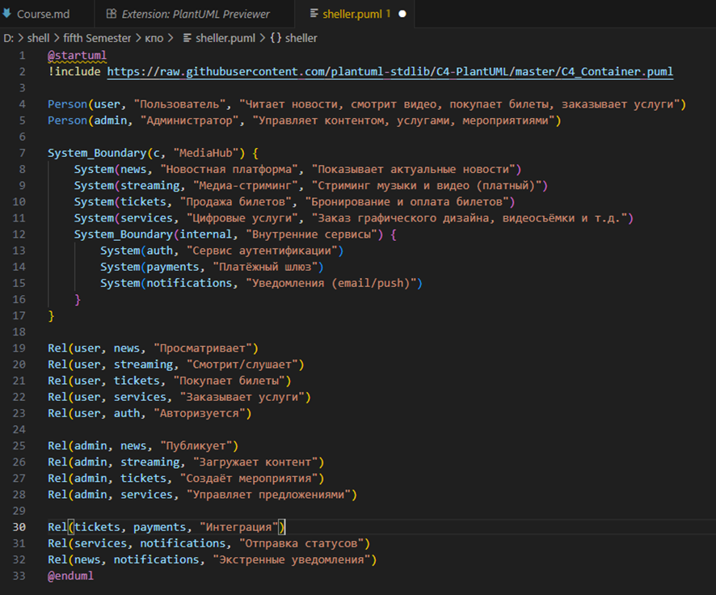

# kpo2025
## Конструирование ПО 2025 - Выработка требований

**Тема:** Веб приложение для компании (Для Новостей)

Звелаке Масеко
 Ха Жа Кинь
 Гюнеш Мустафа

**Группа:** 5130904/30103

 ==============================================================

**1.**   **Основные функции проекта:**

●    Новостная лента (актуальные новости)

●    Музыкальная платформа (стриминг музыки)

●    Видео-стриминг (платный контент)

●    Продажа билетов на мероприятия

●    Платёжные системы: Visa, Mastercard, Apple Pay, PayPal, банковский перевод, MonCash

●    **Услуги:** цифровой маркетинг, графический дизайн, продвижение, видеосъёмка, фотосъёмка

 

**2.**   **Оценка аудитории**

●    Суточная активная аудитория: ~15 000 пользователей

●    Период хранения данных: от 5 до 7 лет 

 

**3.**   **Пользовательские сценарии**

3.1.Как пользователь, я хочу читать актуальные новости и получать уведомления о важных событиях, чтобы не пропустить важную информацию.

**Сценарий:**

●    Пользователь заходит на главную страницу - видит ленту новостей.

●    Может выбрать категории (политика, культура, технологии и т.д.).

●    Может подписаться на push/email - уведомления по выбранным темам.

●    При публикации срочной новости (например, ЧС или крупное событие) - получает уведомление.

 

**Технические аспекты:**

●    RSS / push-уведомления

●    Персонализация ленты

●    Хранение предпочтений пользователя

 

3.2.Как пользователь, я хочу купить билет на концерт через сайт и оплатить его удобным способом, чтобы быстро получить подтверждение и QR-код.

**Сценарий:**

●    Пользователь выбирает мероприятие в разделе «Билеты».

●    Выбирает дату, место, количество билетов.

●    Переходит к оплате - выбирает способ: Visa, Apple Pay, PayPal, MonCash и др.

●    После успешной оплаты получает email с билетом (PDF + QR-код).

●    Билет отображается в личном кабинете.

 

**Технические аспекты:**

●    Интеграция с платёжными шлюзами

●    Генерация QR-кодов

●    Хранение истории покупок (от 5 лет до 7 лет)

 

3.3.Как клиент, я хочу заказать услугу (например, видеосъёмку мероприятия) и связаться с менеджером, чтобы обсудить детали и получить коммерческое предложение.

**Сценарий:**

●    Пользователь заходит в раздел «Услуги» - выбирает «Видеосъёмка».

●    Заполняет форму: дата, тип события, бюджет, контакты.

●    Получает подтверждение и ожидает звонка/письма от менеджера.

●    В личном кабинете видит статус заявки.

**Технические аспекты:**

●    CRM-интеграция или внутренняя система заявок

●    Уведомления о статусе

●    Хранение переписки и договоров

 

3.4.Как подписчик, я хочу смотреть эксклюзивные видео и слушать премиальную музыку, оплатив подписку, чтобы получать доступ к контенту без рекламы.

●    Включает: управление подпиской, автопродление, отмену, историю платежей.

--------------------------------------------------------------------------------------

**Конструирование ПО 2025**

## Архитектура и проектирование

**Тема:** Веб приложение для компании (Для Новостей)

**Масеко Звелаке
Ха Жа Кинь
Гюнеш Мустафа**

**Группа:** 5130904/30103

**1.**   **Характер нагрузки на сервис:**

**1.1.**         **Соотношение R/W нагрузки**

| **Раздел**                        | **Чтение**                 | **Запись**                      |
| --------------------------------- | -------------------------- | ------------------------------- |
| Новостной контент                 | 90%                        | 10% (редакторы, модераторы)     |
| Музыка/видео стриминг             | 95%                        | 5% (загрузка контента админами) |
| Продажа билетов                   | 70% (просмотр мероприятий) | 30% (бронирование, оплата)      |
| Услуги (маркетинг, дизайн и т.д.) | 60%                        | 40% (заявки, коммуникация)      |

**Общее соотношение: 79% R / 21% W**

 

**1.2.**         **Объемы трафика**

**Входящий трафик (к пользователям):**

●   **DAU:** 15 000 пользователей;

●   **Новости/Текст:** ~60 ГБ/день (15к пользователей * ~4 МБ данных статей, CSS, JS).

●   **Музыка:** ~150 ГБ/день (допустим, 20% пользователей слушают ~30 мин = ~50 МБ/пользователь → 3000 * 50 МБ).

●   **Видео (стриминг):** ~1 ТБ/день (для 2000 подписчиков, смотрящих в SD ~1 ГБ/день → 2000 * 500 МБ).

**Исходящий трафик (от пользователей):**

●   Незначительный, в основном загрузка аватарок и форма заявок с файлами.

 

**1.3.**         **Объемы дисковой системы**

●   Новости + метаданные: ~5 ГБ/год

●   Медиаконтент (видео + аудио): ~20 ТБ/год

●   База данных (транзакции, профили, билеты): ~1 ГБ/год

**2.**   **Первые две диаграммы из подхода** [**https://c4model.com/**](https://c4model.com/)

**2.1.**         **System Context Diagram (C4 Level 1)**
``` puml
@startuml
!include https://raw.githubusercontent.com/plantuml-stdlib/C4-PlantUML/master/C4_Container.puml  

Person(user, "Пользователь", "Читает новости, смотрит видео, покупает билеты, заказывает услуги")
Person(admin, "Администратор", "Управляет контентом, услугами, мероприятиями")

System_Boundary(c, "MediaHub") {
    System(news, "Новостная платформа", "Показывает актуальные новости")
    System(streaming, "Медиа-стриминг", "Стриминг музыки и видео (платный)")
    System(tickets, "Продажа билетов", "Бронирование и оплата билетов")
    System(services, "Цифровые услуги", "Заказ графического дизайна, видеосъёмки и т.д.")
    System_Boundary(internal, "Внутренние сервисы") {
        System(auth, "Сервис аутентификации")
        System(payments, "Платёжный шлюз")
        System(notifications, "Уведомления (email/push)")
    }
}

Rel(user, news, "Просматривает")
Rel(user, streaming, "Смотрит/слушает")
Rel(user, tickets, "Покупает билеты")
Rel(user, services, "Заказывает услуги")
Rel(user, auth, "Авторизуется")

Rel(admin, news, "Публикует")
Rel(admin, streaming, "Загружает контент")
Rel(admin, tickets, "Создаёт мероприятия")
Rel(admin, services, "Управляет предложениями")

Rel(tickets, payments, "Интеграция")
Rel(services, notifications, "Отправка статусов")
Rel(news, notifications, "Экстренные уведомления")
@enduml
```

``` puml
@startuml
!include https://raw.githubusercontent.com/plantuml-stdlib/C4-PlantUML/master/C4_Container.puml

Person(user, "Пользователь")

Container_Boundary(b1, "MediaHub") {
    Container(web, "Веб-фронтенд", "React SPA", "HTML/CSS/JS")
    Container(mobile, "Мобильное приложение", "iOS/Android", "Kotlin/Swift")
    
    Container(api_gateway, "API Gateway", "Traefik/Nginx", "Маршрутизация запросов")
    
    Container(news_svc, "Сервис новостей", "Go/Node.js", "REST/GraphQL")
    Container(media_svc, "Сервис медиа", "Go + FFmpeg", "HLS/DASH streaming")
    Container(tickets_svc, "Сервис билетов", "Java/Spring", "Бронирование, инвентарь")
    Container(services_svc, "Сервис услуг", "Python/FastAPI", "CRM-логика")
    
    ContainerDb(db, "PostgreSQL", "Хранение метаданных, профилей, билетов")
    ContainerDb(media_storage, "Объектное хранилище", "S3/MinIO", "Видео, аудио, изображения")
    Container(external_payments, "Внешние платёжные системы", "Visa, PayPal и др.", "REST API")
}

Rel(user, web, "Использует браузер")
Rel(user, mobile, "Использует приложение")
Rel(web, api_gateway, "HTTP/HTTPS")
Rel(mobile, api_gateway, "HTTP/HTTPS")

Rel(api_gateway, news_svc, "GET /news")
Rel(api_gateway, media_svc, "GET /stream")
Rel(api_gateway, tickets_svc, "POST /tickets")
Rel(api_gateway, services_svc, "POST /orders")

Rel(news_svc, db, "Чтение/запись")
Rel(tickets_svc, db, "Транзакции")
Rel(services_svc, db, "Заявки")

Rel(media_svc, media_storage, "Чтение медиафайлов")
Rel(tickets_svc, external_payments, "Интеграция оплаты")
@enduml
```




**2.2.**         **Container Diagram (C4 Level 2)**


**3.**   **Контракты API + Ожидаемые нефункциональные требования на время отклика**

**3.1.**          **Получение списка новостей:**

●   **Метод:** GET /api/v1/news

●   **Параметры:** 

**page** (number, optional)

**category** (string, optional)

**pageSize** (number, optional, default: 20)

●   **Ответ (200 OK):**


●   **Нефункциональные требования:**

**Время отклика (p95):** < 200 мс.

**Доступность (Availability):** > 99.9%.

**Пропускная способность:** > 1000 RPS.

**3.2.**          **Покупка билета**

●   **Метод****:** POST /api/v1/events/{eventId}/tickets

●   **Заголовки:** Authorization: Bearer <JWT>

●   **Тело запроса:**


●   **Ответ (201 Created):**


●   **Нефункциональные требования:**

**Время отклика (p95):** <2 секунды (из-за взаимодействия с платежным шлюзом).

**Согласованность данных:** Сильная (нельзя продать два билета на одно место).

**Безопасность:** PCI DSS compliance для любых операций с картами.


**4.**   **Схема базы данных + почему она выдержит нефункциональные требования**


**5.1.**         **Почему схема выдержит нагрузку:**

●   **Индексы****:** Все PK, FK, email, published_at, event_id, user_id индексируются.

●   **Read Replica:** Все тяжелые SELECT (новости, поиск) идут на реплику.

●   **Кэш:** Redis кэширует списки статей, популярные страницы, сессии. 

●   **Нормализация:** Снижает избыточность данных и аномалии при обновлении.

●   **Шардирование:** При росте можно шардировать Events или Articles по category или дате.

**5.**   **Схема масштабирования сервиса при росте нагрузка 10 раз**

При росте до ~150 000 пользователей/день:

**5.1.**         **Фронтенд:**

●   CDN (Cloudflare, AWS CloudFront) для статики и медиа

●   SSR → ISR (Incremental Static Regeneration) для новостей

**5.2.**         **Бэкенд:**

●   Горизонтальное масштабирование микросервисов (Kubernetes)

●   API Gateway с rate limiting и circuit breaker

**5.3.**         **База данных:**

●   PostgreSQL → read replicas (3–5 шт.)

●   Миграция тяжёлых операций в ClickHouse (аналитика)

●   Кэширование через Redis Cluster

**5.4.**         **Медиа:**

●   HLS-стриминг через Cloudflare Stream или AWS MediaConvert + CloudFront

●   Автоматическое сжатие и транскодирование

**5.5.**         **Платежи:**

●   Асинхронная обработка через очередь (RabbitMQ/Kafka)

●   Идемпотентность запросов

**5.6.**         **Мониторинг:**

●   Prometheus + Grafana


●   Логи в ELK или Loki

