# MediaHub — Многофункциональная медиаплатформа

**Новостной портал + стриминг музыки и видео + продажа билетов + маркетплейс услуг**

Проект представляет собой современное масштабируемое веб-приложение для медиакомпании, объединяющее в себе несколько продуктов на одной платформе.

ссылка: <a href="https://s120187.foxcdn.ru">перейти на сайт</a>

## Основные возможности

| Модуль            | Что умеет                                                    |
| ----------------- | ------------------------------------------------------------ |
| Новостная лента   | Категории, поиск, push-уведомления                           |
| Медиа-стриминг    | Музыка и видео по подписке, antmedia                         |
| Продажа билетов   | онлайн-оплата, генерация PDF                                 |
| Маркетплейс услуг | Заказ дизайна, видеосъёмки, рекламы и др., формы заявок      |
| Админ-панель      | Управление контентом, мероприятиями, услугами, модерация заявок |


## Архитектура (C4 model)

### Уровень 1 — Контекстная диаграмма
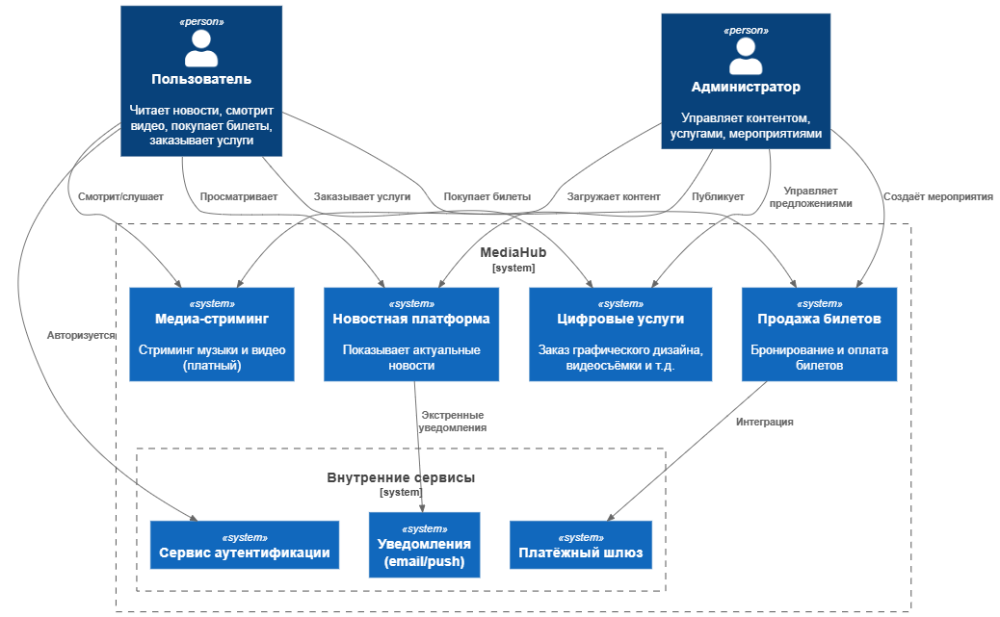

### Уровень 2 — Диаграмма контейнеров (реализация)
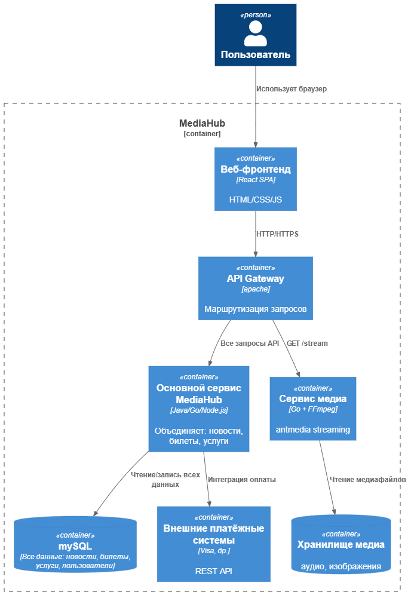

### Технологический стек

| Слой             | Технологии                        |
| ---------------- | --------------------------------- |
| Веб-фронтенд     | React, JS, PHP+HTML, Tailwind CSS |
| API Gateway      | apache                            |
| Сервис стриминга | antmedia                          |
| Сервис услуг     | PHP                               |
| База данных      | MySQL(основная)                   |
| Хранение медиа   | MinIO / AWS S3                    |
| Платежи          | Visa                              |
| Backend          | OneSignal API (push уведомления)  |

# новостная лента

пользователь читает актуальные новости и получает уведомления о важных событиях(новости).

## реализация push уведомлений

Для реализации механизма push-уведомлений в проекте был выбран облачный сервис **OneSignal**.
 Он предоставляет REST API для отправки и получения уведомлений на различные устройства: веб-браузеры, Android и iOS.
 Использование OneSignal позволило отказаться от разработки собственной инфраструктуры, сократить время разработки и обеспечить надёжность доставки сообщений.

## Обоснование выбора OneSignal

Собственная реализация push-уведомлений требует:

- настройки Web Push протокола;
- работы с Firebase Cloud Messaging (Android);
- взаимодействия с APNs (Apple Push Notification Service);
- создания системы хранения токенов устройств;
- масштабируемого сервера доставки;
- управления подписками;
- логирования статусов доставок.

Эти задачи увеличивают сложность проекта и стоимость сопровождения.

OneSignal предоставляет готовую инфраструктуру, включающую:

- единый REST API;
- регистрацию и управление устройствами;
- отправку Web Push, Android и iOS уведомлений;
- высокий процент доставляемости;
- логи и аналитику.

Благодаря этому OneSignal стал оптимальным выбором для проекта.

## Архитектура интеграции

Система push-уведомлений состоит из следующих компонент:

1. **Клиентское приложение (Web/Mobile)**
    Регистрирует устройство в OneSignal, получает токен (player_id) и принимает уведомления.
2. **Backend (сервер)**
    Генерирует события и отправляет запросы к OneSignal API.
3. **OneSignal API**
    Получает запросы от backend и доставляет уведомления пользователю.

## Принцип работы

Последовательность работы системы выглядит так:

1. Пользователь разрешает получение уведомлений в клиентском приложении.

2. Клиент регистрирует устройство в OneSignal и получает уникальный `player_id`.

3. При возникновении события сервер проекта формирует запрос:

   ```
   POST https://api.onesignal.com/notifications
   ```

4. Backend отправляет JSON с данными уведомления:

   ```json
   {
     "app_id": "APPLICATION_ID",
     "include_player_ids": ["PLAYER_ID"],
     "headings": { "en": "New message" },
     "contents": { "en": "You have a new notification!" }
   }
   ```

5. OneSignal доставляет push-уведомление на устройство пользователя.

## Преимущества внедрённой системы

Использование OneSignal обеспечивает:

- надёжную доставку уведомлений;
- минимальные затраты на разработку;
- масштабируемость системы;
- гибкую настройку типов уведомлений;
- удобную аналитику и статистику;
- простую интеграцию через REST API.


Интеграция OneSignal позволила реализовать гибкую и масштабируемую систему push-уведомлений без необходимости разработки собственной сложной инфраструктуры.
 Backend взаимодействует с OneSignal как с внешним API-провайдером, а клиентские устройства напрямую получают уведомления.

Таким образом, OneSignal является ключевым компонентом коммуникационной подсистемы проекта, обеспечивая стабильную доставку уведомлений и удобство взаимодействия с пользователем.

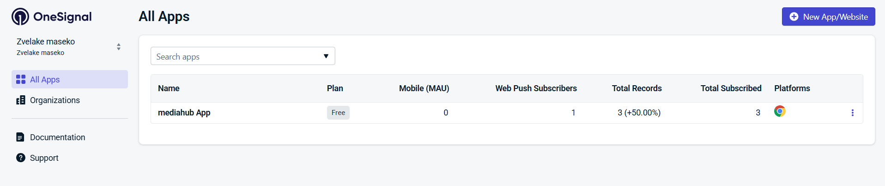

**OneSignal платформа**


**интерфейс подписки пользователей**

при нажатии кнопки пользователи подписываются на push уведомления новостей. при новых обновлениях или публикациях они получают уведомления подобное на в этом изображении.

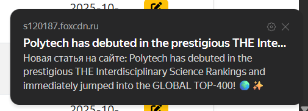

​							**push уведомление на экране подписчиков**

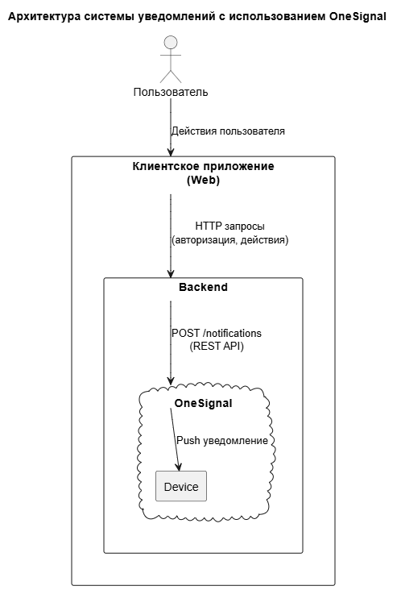


## Получение новостей и формат API-ответов

## 1. Общая концепция

В проекте реализована комбинированная система загрузки новостного контента. Источники данных разделены на два уровня:

1. **Собственный новостной API**, предоставляющий материалы, размещённые локально в системе управления сайтом.
2. **Внешний поставщик новостей — NewsAPI.org**, используемый для получения актуальных международных новостей.

Такой подход обеспечивает:

- независимость и автономность локальных публикаций,
- возможность расширения контента за счёт внешнего агрегатора,
- унифицированный формат хранения и отображения новостей на клиенте.

------

## 2. Получение новостей через собственный API

Для доступа к внутренним новостям разработан REST-эндпоинт:

```
GET https://s120187.foxcdn.ru/php/dbReade.php?r=news
```

API возвращает JSON-массив объектов, где каждый объект — одна новостная публикация. Серверная часть реализована на PHP и взаимодействует с MySQL, формируя выходные данные в стандартизированном формате.

### Формат ответа внутреннего API

Пример возвращаемой структуры:

```json
[
  {
    "id": 29,
    "newsImg": 108,
    "newsTitle": "В Музее военно-морской славы России ...",
    "newsDate": "2025-11-28",
    "newsCategory": "politics",
    "newsHeadline": "Политех в авангарде воспитания...",
    "fullContent": "Мероприятие, организованное Комитетом...",
    "image_location": "/admin/controllers/../uploads/images/6929c0c1a9156.jpg"
  }
]
```

### Описание полей

| Поле               | Описание                                    |
| ------------------ | ------------------------------------------- |
| **id**             | Уникальный идентификатор новости            |
| **newsImg**        | ID изображения в базе или файловой системе  |
| **newsTitle**      | Заголовок публикации                        |
| **newsDate**       | Дата публикации в формате YYYY-MM-DD        |
| **newsCategory**   | Категория (политика, культура, спорт и др.) |
| **newsHeadline**   | Подзаголовок / лид-абзац                    |
| **fullContent**    | Полный текст новости                        |
| **image_location** | Путь к изображению на сервере               |

API гарантирует:

- корректную кодировку UTF-8,
- отсутствие HTML внутри текстовых полей,
- единый формат дат,
- структурированное хранение контента для дальнейшего рендеринга на клиентской стороне.

------

## 3. Получение новостей из внешнего сервиса NewsAPI

Для расширения набора новостей используется открытый сервис **NewsAPI.org**.

Запрос к сервису выполняется в формате:

```
GET https://newsapi.org/v2/everything?q=Apple&from=2025-11-24&sortBy=popularity&apiKey=API_KEY
```

### Параметры запроса

| Параметр   | Значение                                         |
| ---------- | ------------------------------------------------ |
| **q**      | Ключевое слово (*Apple*, *Russia*, *Technology*) |
| **from**   | Начальная дата выборки                           |
| **sortBy** | Критерий сортировки (popularity / publishedAt)   |
| **apiKey** | Ключ доступа                                     |

### Формат ответа NewsAPI

Сервис возвращает объект:

```json
{
  "status": "ok",
  "totalResults": 218,
  "articles": [
    {
      "source": { "id": null, "name": "Example.com" },
      "author": "John Doe",
      "title": "Apple releases new technology",
      "description": "...",
      "url": "https://example.com/news/apple",
      "urlToImage": "https://example.com/image.jpg",
      "publishedAt": "2025-11-24T10:21:00Z",
      "content": "Полный текст новости..."
    }
  ]
}
```

------

## 4. Объединение данных и единство структуры

Так как внутренний API и NewsAPI имеют разный формат, на стороне клиента реализован слой адаптации данных.

### Пример унификации:

**Внутренняя новость → Модель:**

```json
{
  "title": newsTitle,
  "date": newsDate,
  "image": image_location,
  "category": newsCategory,
  "description": newsHeadline,
  "content": fullContent
}
```

**Внешняя новость → Модель:**

```json
{
  "title": article.title,
  "date": article.publishedAt,
  "image": article.urlToImage,
  "category": "external",
  "description": article.description,
  "content": article.content
}
```

После преобразования обе группы новостей отображаются одинаково, что делает систему гибкой и масштабируемой.

------

## 5. Итоговая схема обработки новостей

1. Клиент при загрузке страницы отправляет два параллельных запроса:
   - на собственный API,
   - на внешний NewsAPI.
2. Оба ответа приводятся к единой модели данных.
3. Все новости объединяются в общий массив.
4. Выполняется сортировка по дате или популярности.
5. Результат отображается пользователю.


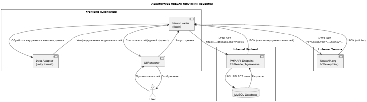

пользователь заходит на главную страницу и видит ленту новостей. Он может заходит на главную страницу новостей и выбрать категории (политика, культура, технологии, и т.д.)

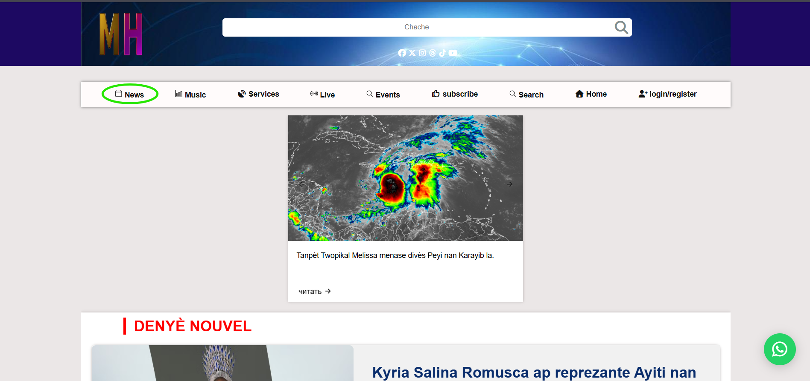

**главная страница с выделенной ссылкой на страницу новостей**


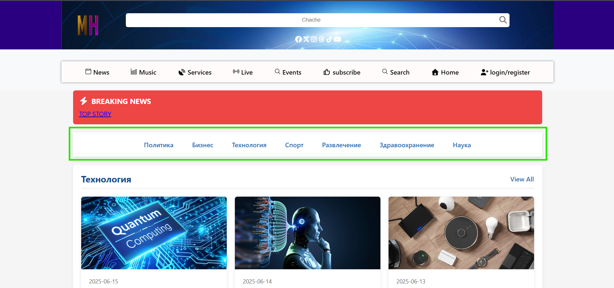

**страница новостей: возможность выборки по категрии**


# Медиа-стриминг

Музыка и видео по подписке, AntMedia

### Описание системы
Система предоставляет доступ к трансляциям через веб-приложение:

1. **Источник данных**: Внутренняя БД с информацией о трансляциях
2. **API для получения трансляций**: `https://s120187.foxcdn.ru`
3. **Пример ответа API**:
```json
[
  {
    "id": 3,
    "stream_date": "2025-11-08 21:30:00",
    "stream_title": "Stream test",
    "stream_key": "ywYWI7xADZDdAW69"
  },
  {
    "id": 2,
    "stream_date": "2025-10-20 04:54:00",
    "stream_title": "Presentation Of Final Work",
    "stream_key": "df2d4eaa3a65d1b43e90"
  }
]
```

### Процесс работы пользователя
1. **Просмотр доступных трансляций**:
   - Пользователь заходит на страницу трансляций
   - Видит текущие и будущие трансляции

2. **Доступ к трансляции**:
   - Нажимает кнопку "Смотреть" на текущей трансляции
   - Если не оплатил → перенаправление на страницу оплаты (Stripe)
   - Если оплатил → ввод реквизитов (ключ, логин, пароль)

3. **Процесс оплаты**:
   - Используется Stripe для обработки платежей
   - После успешной оплаты пользователь получает реквизиты для копирования
   - Реквизиты используются для доступа к трансляции

### Диаграмма последовательности
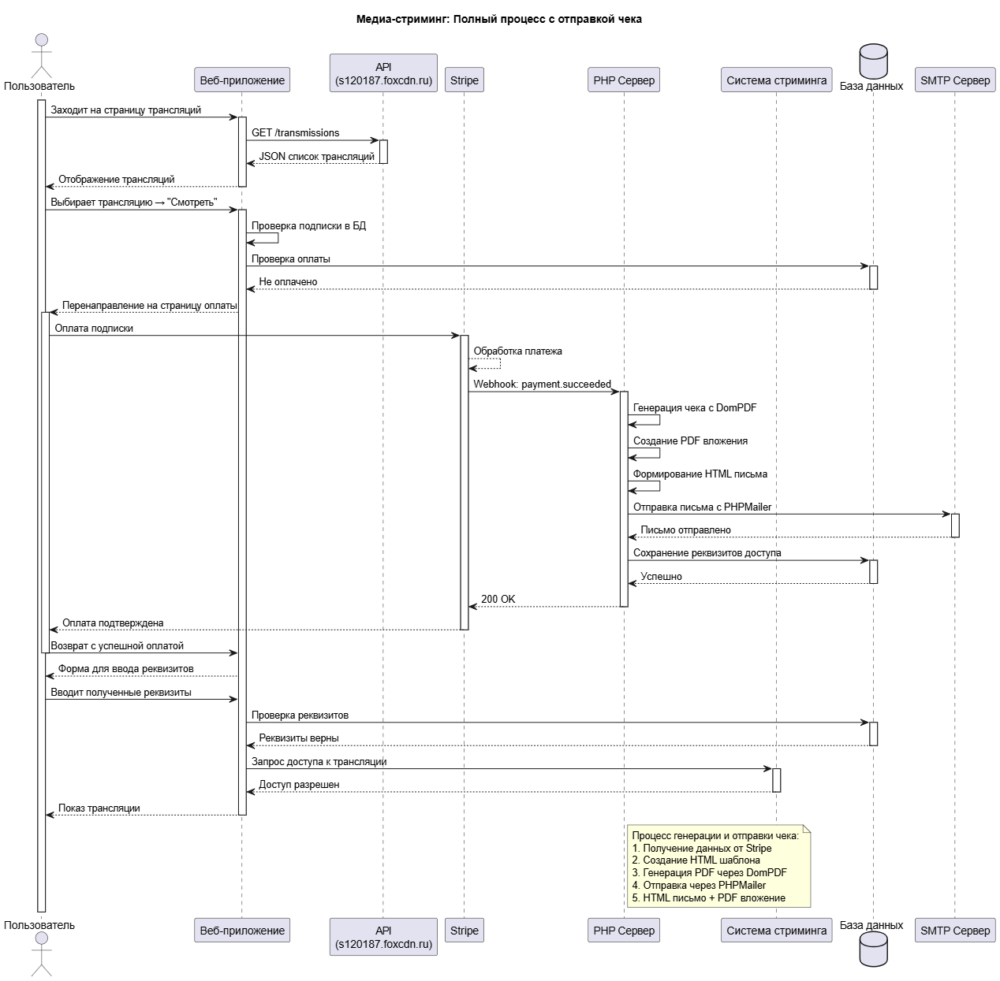

### Архитектурная схема
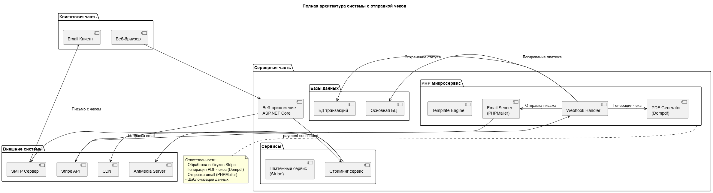


**ответ клиенту после оплаты**


### Процесс отправки чека после оплаты

1. **Получение подтверждения оплаты**:
   - Stripe отправляет вебхук о успешной оплате
   - Наш сервер получает подтверждение
2. **Генерация чека**:
   - Используется PHP с библиотекой **Dompdf** для создания PDF
   - Формируется HTML-шаблон чека
   - Конвертация HTML в PDF документ
3. **Отправка письма**:
   - Используется **PHPMailer** для отправки email
   - Письмо содержит:
     - HTML версию чека
     - PDF версию в виде вложения
     - Реквизиты для доступа к трансляции

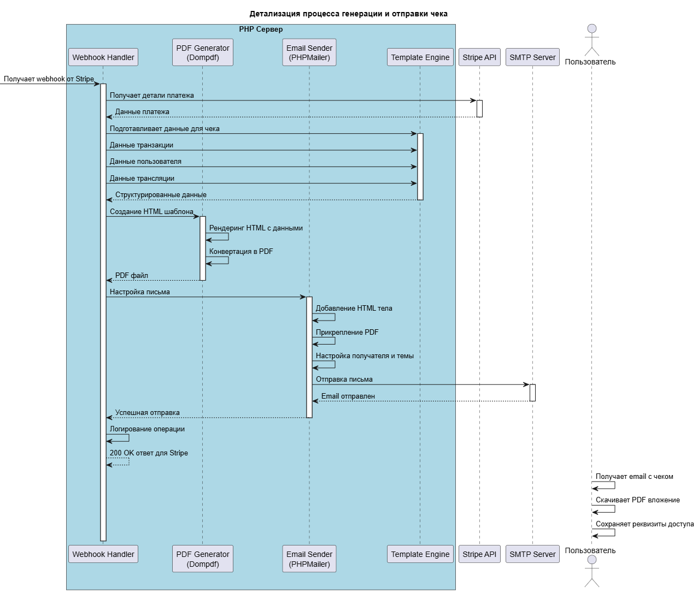


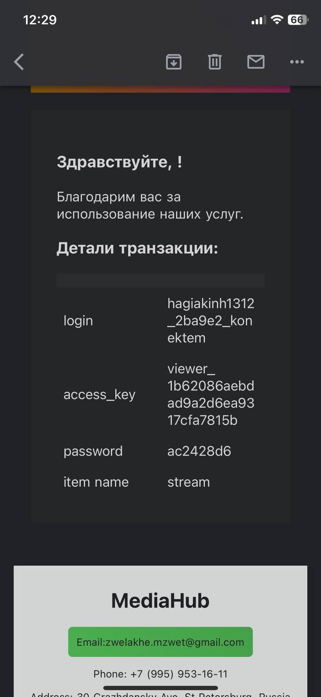

​											**пример почты у клиента**

## Продажа билетов

Модуль продажи билетов отвечает за поддержку полного цикла покупки билета на мероприятие: от выбора события на сайте до получения пользователем электронного билета в формате PDF и письма с чеком от платёжной системы. Этот модуль является важной частью приложения, так как приносит прямой доход и тесно интегрирован как с пользовательским интерфейсом, так и с внешним платёжным провайдером.

### Описание модуля

Пользователь заходит в раздел **«Events»**. На этой странице он видит список доступных мероприятий с основными параметрами:

- название мероприятия;
- дата и время проведения;
- город и площадка (location);
- цена билета.

После выбора интересующего события пользователь и может увидеть цену за один билет. В базовой версии прототипа пользователь покупает один или несколько стандартных билетов на выбранное мероприятие.

### Источник данных

Информация о мероприятиях хранится в нашей базе данных и доступна через внутренний API. Пример структуры:

```json
[
  {
    "id": 4,
    "title": "Sinach Night of Worship",
    "eventDate": "2025-11-21",
    "location": "Reggie Lewis Center, Boston MA",
    "price": 10,
    "eventImage": 37,
    "image_location": "/uploads/images/68f58b62e8e37.jpg"
  }
]
```

### Процесс покупки билета

1. Пользователь открывает список событий.
2. Frontend получает данные через API.
3. Пользователь нажимает **Buy Ticket**.
4. инициализирует оплату через **Stripe (Visa)**.
5. Пользователь  оплачивает билет.
6. Stripe отправляет:
   - ответ об успешном платеже,
7. Backend обновляет заказ на `paid` и генерирует **PDF-билет**.
8. **receipt (чек)** пользователю на e-mail.

### API

- `GET https://s120187.foxcdn.ru/php/dbReader.php?r=events`

### Нефункциональные требования

- Время отклика чтения: ≤ 500 мс  
- Создание оплаты: ≤ 2 сек (Stripe)  
- Идемпотентная обработка webhook  
- Безопасность данных (PCI DSS, мы не храним данные карт)

### Диаграмма (PUML)

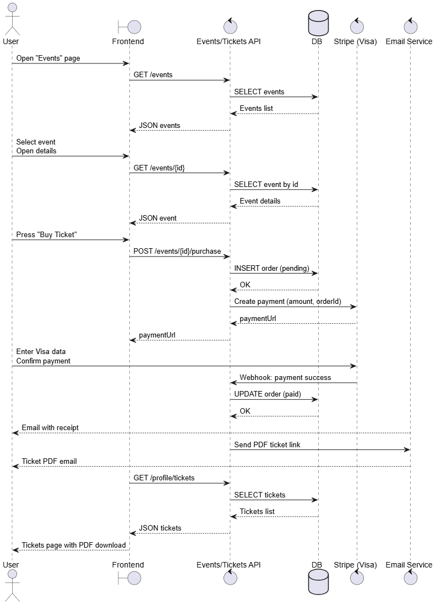


**страница событий**


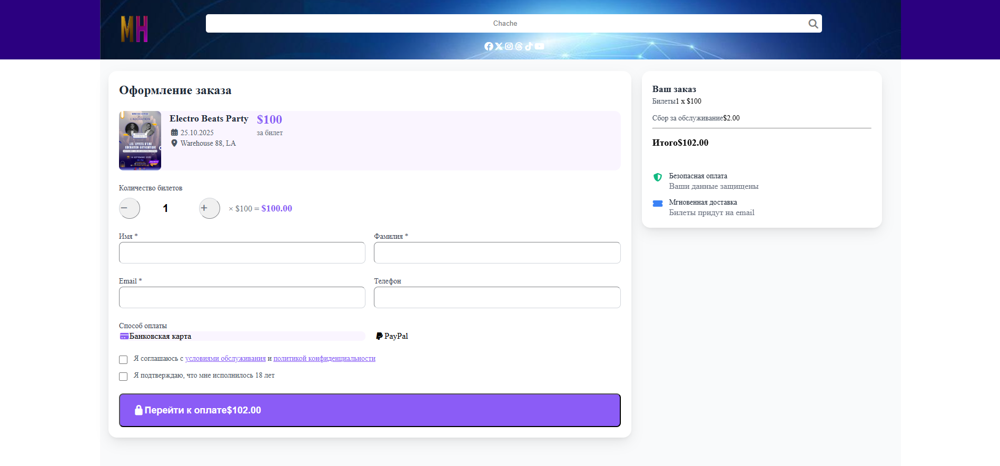

**покупка билетов**


**уведомление после оплаты**


**почта у клиента с билетом**


## Заказ услуги и сохранение ордера в таблице `orders`

В сценарии «Как клиент, я хочу заказать услугу (например, видеосъёмку мероприятия) и связаться с менеджером, чтобы обсудить детали и получить коммерческое предложение» мы обрабатываем запрос как ордер и сохраняем его в базе данных в таблице `orders`.

### Описание процесса

1. Клиент открывает раздел **«Услуги»** и выбирает нужную услугу.
2. Клиент заполняет форму заказа: контактные данные, описание задачи, дата, длительность, бюджет и т.п.
3. Frontend отправляет запрос:  
   `POST https://s120187.foxcdn/php/dbReader.php?r=services`
4. Backend валидирует данные и создает запись в таблице `orders` со статусом `pending`:
   - `client_id`
   - `event_id` или `serviceId`
   - `ticket_count` (как количество единиц услуги)
   - `total_amount`
   - `order_status = 'pending'`
   - `payment_status = 'pending'`
   - `order_date`
5. Backend возвращает order_id` и текущий статус.
6. Менеджер видит заказ, связывается с клиентом и обновляет статус (`confirmed`, `cancelled`, `completed`).

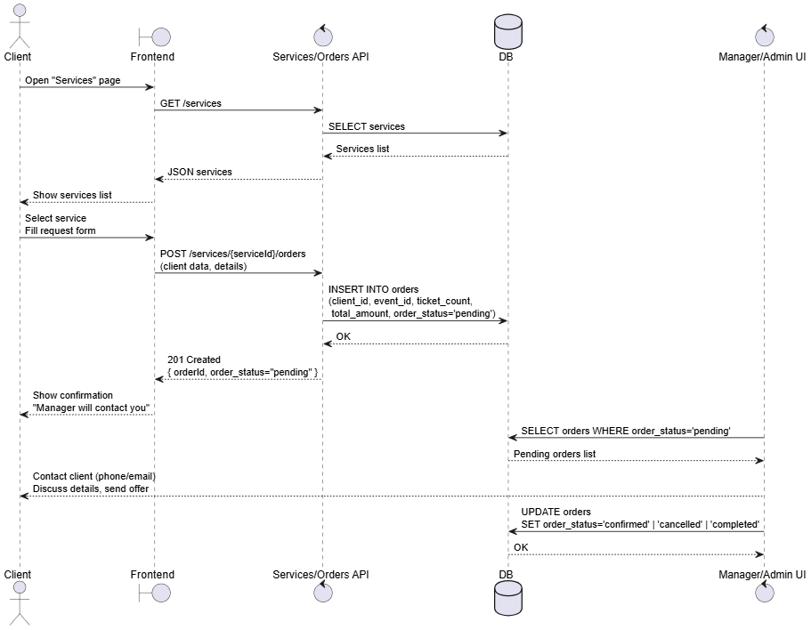

 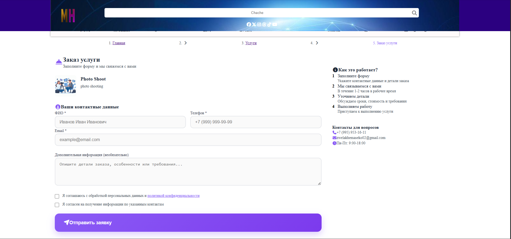

**клиент заказывает услугу**


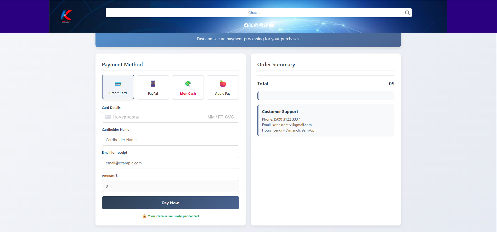

**перенаправление на оплату**


**при успешной оплате. ему отправляем почту с чеком**

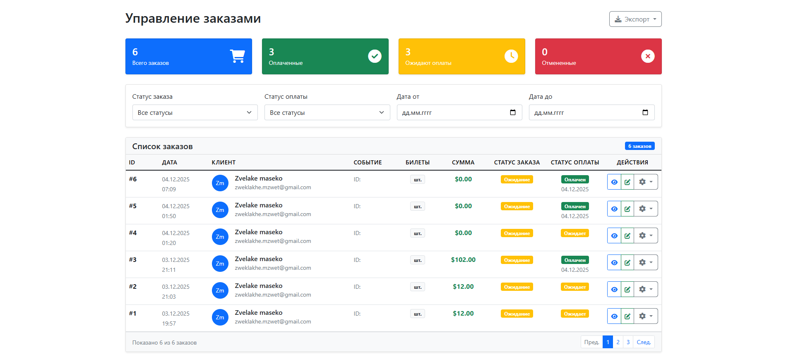

**управление заказами**


## контент музыки

## Система управления медиаконтентом

### Музыкальный каталог
**Для музыкальных файлов реализована следующая система:**

1. **Хранение файлов**: Музыкальные файлы хранятся на файловом сервере (не в объектном хранилище)
2. **Метаданные и информация**: Доступны через API `https://s120187.foxcdn.ru/php/dbReader.php?r=musicContent`
3. **Видео контент**: Не сохраняется на сервере. Стриминг видео происходит исключительно через **AntMedia** в реальном времени


#### Для музыкального контента:
1. **API предоставляет полный каталог**:
   ```json
   // Пример ответа API musicContent
   [
     {
       "artist_id": 11,
       "id": 19,
       "artist_name": "Revelasyon",
       "track_name": "Se nan ou Senyè mwen kapab viv",
       "track_img_id": 98,
       "location": "/admin/controllers/../uploads/music/690d42d856d84.mp3",
       "mime_type": "audio/mpeg",
       "likes": 5,
       "downloads": 1,
       "plays": 6,
       "image_location": "/admin/controllers/../uploads/images/690d42d855eea.jpg"
     },
   ]
   ```

   
   
3. **Доступ для пользователей**:
   - **Прослушивание**: Через встроенный аудиоплеер на сайте
   - **Скачивание**: Доступно по прямой ссылке
   - **Поиск и фильтрация**: По названию

#### Для видео контента:
1. **Только стриминг через AntMedia**:
   - Видео не хранится в файловой системе
   - Трансляции происходят в реальном времени
   - Доступ к архиву не предусмотрен (если не настроено отдельно в AntMedia)

2. **Информация о трансляциях**:
   - Через API трансляций (уже описан ранее)
   - Только текущие и запланированные трансляции

### Обновленная архитектурная диаграмма
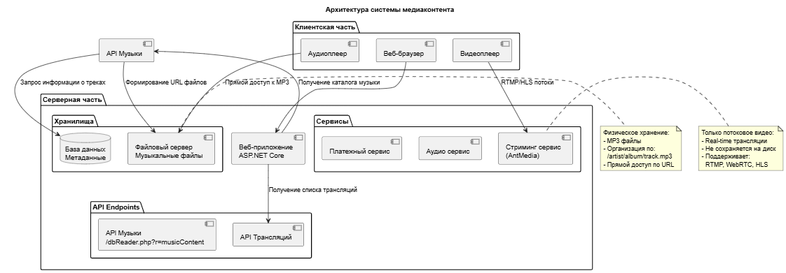

### Процесс доступа к музыкальному контенту
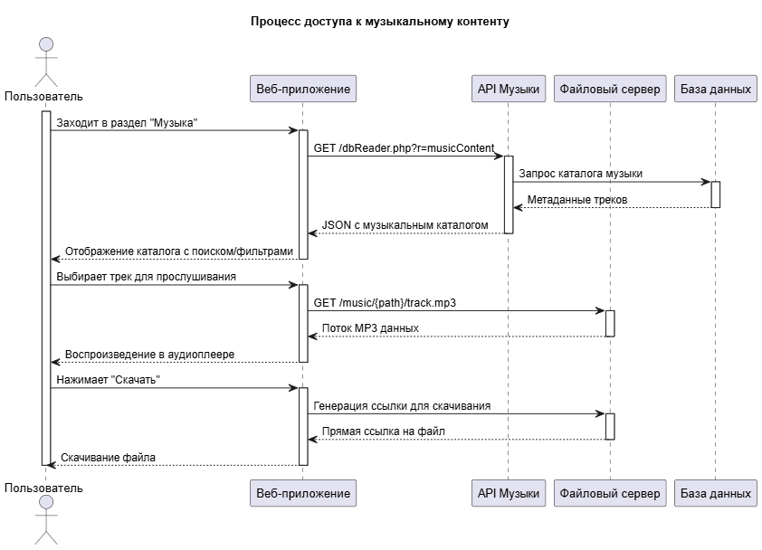

### Ключевые особенности системы

#### 1. **Отделение метаданных от файлов**
- **База данных**: Хранит только метаинформацию (названия, артисты, жанры, пути к файлам)
- **Файловый сервер**: Хранит физические MP3 файлы
- **API**: Связывает метаданные с фактическими файлами

#### 2. **Безопасность и доступ**
- **Публичный доступ**: Только прослушивание (потоковая передача)
- **Скачивание**: все могут скачать файлы (нуно пройсти аутентификации)
- **Проверка прав**: Перед генерацией ссылок на скачивание

#### 3. **Масштабируемость**
- **Файловый сервер**: Можно заменить на CDN для больших объемов
- **База данных**: Легко добавлять новые поля метаданных
- **API**: Единая точка доступа к каталогу

### Ответы для пользователей:
1. **"Где найти музыку?"** → Раздел "Музыка" на сайте с полным каталогом
2. **"Как скачать?"** → кнопка "Скачать"
3. **"Где посмотреть видео?"** → Раздел "Трансляции" с расписанием
4. **"Можно ли сохранить видео?"** → Нет, только просмотр в реальном времени


